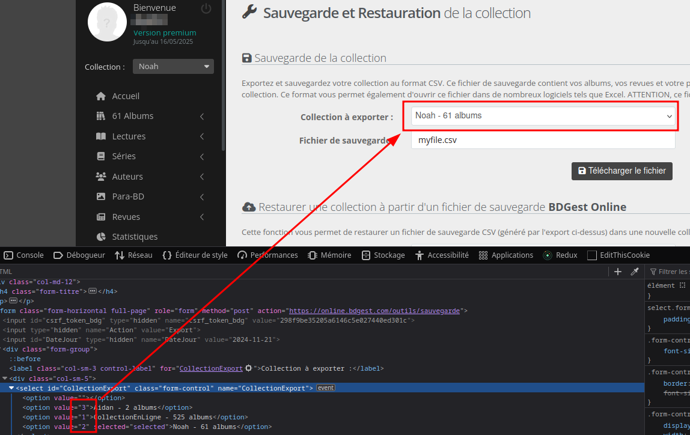

# Export BDgest library to HTML files

This is a simple pet project that fetches CSV out of [BDGest](https://online.bdgest.com/), parse them, and create an HTML file.

## Why

I've been collecting _bande dessinnées_ (Belgian/European/Western comic books, depending on how you call them) since I was a kid. For years I found it hard to keep track of what I had versus what I wanted, but I never really care enough to make something to fix it.

It all changed when my kids started their own collection. What was at worse a medium inconvenience slowly became more and more frustrating. There's nothing sadder than seeing a kid so happy to receive a new comic book, only to realise it is one he already has.

I finally decided to sign up for [BDGest](https://online.bdgest.com/) which was a huge help : The web app works fine, the mobile app allow quick add thanks to the barcode scanner, and I'm able to manage multiple collections (one for me, and one for each of my kids).

Now the problem was that BDGest doesn't include a way to share your collection easily. This was again a mild inconvenience until this happened :


> Which Nelson album is Noah missing?
> Having a look
> Ok
> Oh and Kid Paddle as well please
> Yeah OK but my connection is slow
> Fuck it's not loading
> Oh here we are
> I'm gonna list the one he already has
> Nelson : 1, 2, 3, 4, 5, 6, 7, 11, 12, 16, 18, 19, 25, 26
> Kid Paddle 1, 2, 3, 4, 11, 13, 19 + Best Of : Jurassic Paddle

## How

BDGest provides a way to export collection in CSV. So I started by writing a small bash script (`build_page.sh`) that would open a CSV file, parse it, and write a table into an HTML file.

Since I wanted it to be _somewhat_ pretty but didn't want to have some heavy CSS framework, I used [Pico CSS](https://picocss.com/) to dress my page a little.

I also wanted a way to filter the result, but then again, didn't want any heavy framework, so I wrote some very basic vanilla JS code to filter the table (and yes, I am aware that the header is considered like a standard line - It's ugly, but it works).

Now as much as I was happy with the result, it meant that I had to manually log in to BDGest, export the 3 CSV files, and run my script, which, let's be honest, I would have given up doing before Christmas (I'm writing this the 21st of November)

So I wrote a second script, `get_collection.rb` which responsibility is to log in to BDGest with my login and password, and export the CSV file of the given collection. Then again, it's ugly, but it works.

## Wrapping it up

I finally wrote a `run.sh` script (not included in this repo) that run the two scripts 3 times : once for my collection, once for each of my kids) and then sends the content of the `public` folder on one of my server.
This script is ran once a day through a cronjob.

## What now?

Well, nothing. This is a pet project, it solves a very specific problem of mine, so I consider this code "done".

Most of the code could be refactored, it's under optimized, but for the 3rd time : it's ugly, but it works.

## Dependencies

- Ruby
  - Nokogiri
  - HTTParty

## Environment variables

`BDGEST_USERNAME` : Your BDGest username (email)

`BDGEST_PASSWORD` : Your BDGest password

## How to fetch BDGest CSV Export

```sh
ruby get_collection.rb cedric.csv <COLLECTION_ID>
```

The `COLLECTION_ID` can be found here [Outils > Sauvegarde](https://online.bdgest.com/outils/sauvegarde) by inspecting the values of the `<select>` element



The script will write `cedric.csv` into the `./tmp` directory

## How to generate the HTML file

```sh
sh build_page.sh cedric
```

The script will look for the file `cedric.csv` into the `./tmp` directory and generate an HTML page that will be stored under `public/cedric.html`
